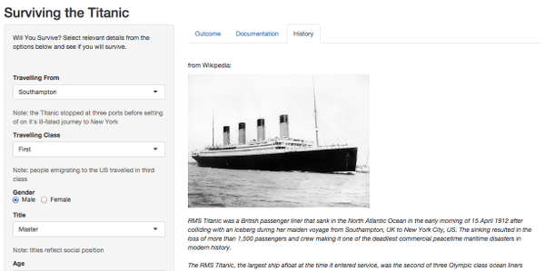

## The Introduction

This presentation is part of the peer assessment for the Developing Data Products course. 
The other part of the assessment involved developing a simple Shiny application. This is 
the pitch for the application.

For my application I decided to train a classifier to predict whether or not a particular 
type of person would have survived the maiden voyage of the Titanic. The application allows 
users to interactively set values that define a profile of a person, and to see the outcome 
of the prediction based on these set values. 

While the application may be of interest to those of a morbid disposition, I do feel it 
could be a useful application in the context of a history class. Also, it could be an 
interesting and fun example of a simple Shiny application for those starting out.


--- .class #id 

## The Data

I used the Titanic data from the Kaggle competition to train the classifier.


```
##   Survived Pclass    Sex Age Embarked Title FamilySize
## 1        0      3   male  22        S    Mr          2
## 2        1      1 female  38        C    Ms          2
## 3        1      3 female  26        S  Miss          1
## 4        1      1 female  35        S    Ms          2
## 5        0      3   male  35        S    Mr          1
## 6        0      3   male  28        Q    Mr          1
```
I began by removing the least important features, and then I took the _Name_ feature and 
broke _Title_ out of it - which allowed me to create a new feature. Also _FamilySize_ was 
derived from adding _Parch_ and _SibSp_, which individually were not that important.


--- .class #id 

## The Code

The Caret package was used to train a Random Forest classifier:


```r
    data  <- load_training_data();

    model <- train(
        Survived ~ ., 
        method     = 'rf', 
        data       = data,
        trControl  = trainControl(method = 'oob', number = 4)
    );
```
I tried a number of different classifiers (see the analysis doc in repository), and 
found that Random Forest performed the best (in terms of Accuracy / OOS Error) on the 
given data.

--- .class #id 


## The Application

This is what the application looks like:



The user selects different values for the different features, creating a profile of a person, 
then presses the 'Make Prediction' button once complete, and then sees whether or not the 
person would have survived.

And that's the application. I hope you enjoy playing with it.

