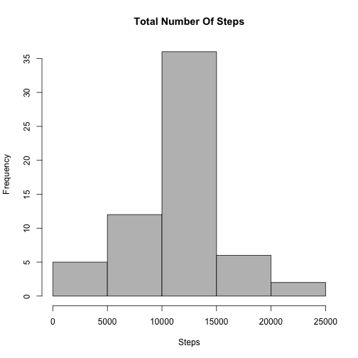

## Loading and preprocessing the data

First I loaded the required libraries, then unzipped the archive (if it wasn't already unzipped), then I load the dataset.


```r
    if (!require('plyr')) {

        install.packages('plyr');
        require('plyr');
    }

    if (!require('reshape2')) {

        install.packages('reshape2');
        require('reshape2');
    }

    if (!file.exists('activity.csv')) {

        unzip('./activity.zip', exdir = '.');
    }

    activity <- read.csv('activity.csv');
```

## What is mean total number of steps taken per day?

To answer this question I used reshape - melt followed by downcast - to get aggregations of steps by day.
Then I plotted a histogram of the dataset, to get an idea of how the steps per day are distributed.


```r
    activity_long <- melt(activity, id.vars = "date", measure.vars = "steps", na.rm = TRUE);
    activity_wide <- dcast(activity_long, date ~ variable, sum);

    hist(activity_wide$steps, 
         col = 'grey', 
         main = 'Total Number Of Steps', 
         xlab = 'Steps'
    );
```

 

I calculated the mean and median.


```r
    steps_mean   <- mean(activity_wide$steps);
    steps_median <- median(activity_wide$steps);
```

The mean was 10766.19 and the median was 10765.

## What is the average daily activity pattern?

To answer this question I once again used reshape to get aggregations of steps by interval across all days.
Then I plotted a timeseries of the dataset.


```r
    interval_long <- melt(activity, id.vars = "interval", measure.vars = "steps", na.rm = TRUE);
    interval_wide <- dcast(interval_long, interval ~ variable, mean);

    plot(interval_wide$interval, 
         interval_wide$steps, 
         col = 'blue', 
         main = 'Average Daily Activity Pattern', 
         xlab = '5 Minute Interval', 
         ylab = 'Average Number Of Steps Taken', 
         type = 'l'
    );
```

 

I calculated the max interval value across all days.


```r
    max_steps    <- max(interval_wide$steps);
    max_interval <- interval_wide[interval_wide$steps == max_steps, 1];
```

The interval with the maximum value was 835, with a max value of 206.1698.

## Imputing missing values

To begin with, I calculated the total number of missing values (NAs) in the dataset.


```r
    sum(is.na(activity$steps));
```

```
## [1] 2304
```

Then I assigned the interval mean to the missing values in the dataset, to create a new dataset.


```r
    activity_cleaned <- ddply(activity, ~interval, function(item) { 

        item$steps[is.na(item$steps)] <- round(mean(item$steps, na.rm = TRUE));
        return(item);
    });
```

Then to confirm I had provided values for all NAs I calculated the total number of missing values 
in the new dataset.


```r
    sum(is.na(activity_cleaned$steps));
```

```
## [1] 0
```

Once again I plotted a histogram - this time of the new dataset.


```r
    activity_cleaned_long <- melt(activity_cleaned, id.vars = "date", measure.vars = "steps", na.rm = TRUE);
    activity_cleaned_wide <- dcast(activity_cleaned_long, date ~ variable, sum);

    hist(activity_cleaned_wide$steps, 
         col = 'grey', 
         main = 'Total Number Of Steps', 
         xlab = 'Steps'
    );
```

 

And I calculated the mean and median of the new dataset.


```r
    steps_cleaned_mean   <- mean(activity_cleaned_wide$steps);
    steps_cleaned_median <- median(activity_cleaned_wide$steps);
```

The new mean was 10765.64 and the median was 10762.
The original mean was 10766.19 and the original median was 10765. So
the process of imputing missing values had a small effect on the statistics of the dataset.

## Are there differences in activity patterns between weekdays and weekends?

To answer this I first added a new column that specified if the row contained weekend or weekday data.


```r
    activity_cleaned$date    <- as.Date(activity_cleaned$date);
    activity_cleaned$weekend <- ifelse(weekdays(activity_cleaned$date) %in% c('Saturday', 'Sunday'), 'Weekend', 'Weekday');
```

Then I performed the usual aggregation, this time by interval and weekend.


```r
    activity_cleaned_long <- melt(activity_cleaned, id.vars = c("interval", "weekend"), measure.vars = "steps", na.rm = TRUE);
    activity_cleaned_wide <- dcast(activity_cleaned_long, interval + weekend ~ variable, mean);

    activity_cleaned_weekend <- subset(activity_cleaned_wide, weekend == 'Weekend');
    activity_cleaned_weekday <- subset(activity_cleaned_wide, weekend == 'Weekday');
```

I then constructed plots for Weekdays and Weekends.


```r
    par(mfrow = c(2, 1));

    plot(activity_cleaned_weekend$interval, 
         activity_cleaned_weekend$steps, 
         col = 'blue', 
         main = 'Weekend', 
         xlab = 'Interval', 
         ylab = 'Number of Steps', 
         type = 'l'
    );

    plot(activity_cleaned_weekday$interval, 
         activity_cleaned_weekday$steps, 
         col = 'blue', 
         main = 'Weekday', 
         xlab = 'Interval', 
         ylab = 'Number of Steps', 
         type = 'l'
    );
```

 

I calculated the max, mean, and median values across intervals for weekdays and weekends.


```r
    weekday_max    <- max(activity_cleaned_weekday$steps);
    weekday_mean   <- mean(activity_cleaned_weekday$steps);
    weekday_median <- median(activity_cleaned_weekday$steps);

    weekend_max    <- max(activity_cleaned_weekend$steps);
    weekend_mean   <- mean(activity_cleaned_weekend$steps);
    weekend_median <- median(activity_cleaned_weekend$steps);
```

The weekday maximum was 230.3556 and the weekend maximum 
was 166.625. The weekday mean was 
35.60864 and the weekend mean was 42.36458.
The weekday median was 25.81111 and the weekend median 
was 32.3125. There seems to be more activity during the week as you would
expect (people work during the week), but both weekend and weekdays follow similiar patterns - most activity 
between 800 and around 2100. 
