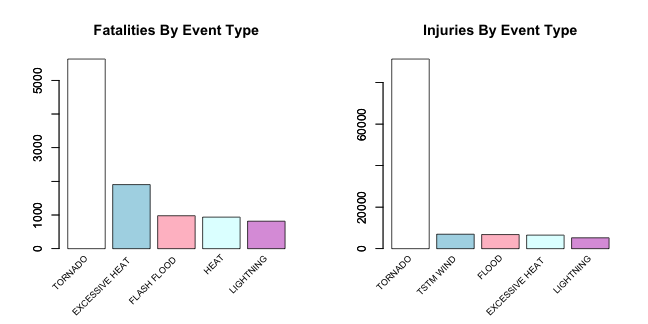
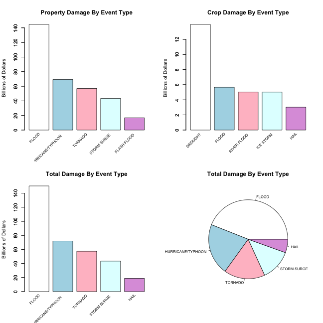

# Analyzing Severe Weather Events


## Synopsis


In this project we will perform a basic analysis of the effect of severe weather events, 
in both the public health and economic senses, on the community. For our analysis we will 
be using the U.S. National Oceanic and Atmospheric Administration's (NOAA) storm 
database.

> This database tracks characteristics of major storms and weather events in the United States, 
> including when and where they occur, as well as estimates of any fatalities, injuries, and 
> property damage.

We will attempt to answer the following questions:

1. Across the United States, which types of events are most harmful with respect to population health?

2. Across the United States, which types of events have the greatest economic consequences?


## Data Processing

First load the libraries required for the analysis.


```r
    if (!require('reshape2')) {

        install.packages('reshape2');
        require('reshape2');
    }
```

Then download the data if it isn't already present.


```r
    if (!file.exists('./repdata-data-StormData.csv.bz2')) {

        download.file(
            url = 'https://d396qusza40orc.cloudfront.net/repdata%2Fdata%2FStormData.csv.bz2', 
            destfile = './repdata-data-StormData.csv.bz2', 
            method = 'curl'
        );
    }
```

Next read the data, taking care to read it in as-is. The column names are listed below.


```r
    storm_data <- read.csv(bzfile('repdata-data-StormData.csv.bz2'), as.is = TRUE);
    names(storm_data);
```

```
##  [1] "STATE__"    "BGN_DATE"   "BGN_TIME"   "TIME_ZONE"  "COUNTY"    
##  [6] "COUNTYNAME" "STATE"      "EVTYPE"     "BGN_RANGE"  "BGN_AZI"   
## [11] "BGN_LOCATI" "END_DATE"   "END_TIME"   "COUNTY_END" "COUNTYENDN"
## [16] "END_RANGE"  "END_AZI"    "END_LOCATI" "LENGTH"     "WIDTH"     
## [21] "F"          "MAG"        "FATALITIES" "INJURIES"   "PROPDMG"   
## [26] "PROPDMGEXP" "CROPDMG"    "CROPDMGEXP" "WFO"        "STATEOFFIC"
## [31] "ZONENAMES"  "LATITUDE"   "LONGITUDE"  "LATITUDE_E" "LONGITUDE_"
## [36] "REMARKS"    "REFNUM"
```

Now that the data has been read in, begin the process of cleaning it. First, change the column 
names to lowercase, then retain only the columns that will be used in the analysis, and finally 
convert the event type column to a factor.


```r
    names(storm_data) <- tolower(names(storm_data));
    storm_data        <- storm_data[, c('evtype', 'fatalities', 'injuries', 'propdmg', 'propdmgexp', 'cropdmg', 'cropdmgexp')];
    storm_data$evtype <- as.factor(storm_data$evtype);
```

Taking a look at the cost data, we see it is split into two - amount and exponent. Because of this, 
for the purpose of facilitating cost analysis, the two columns should be combined into a total, 
after converting the exponent into a numeric value. To achieve this I provided a function (see below).


```r
    clean_numeric_data <- function(data) {

        data[data %in% c('', '+', '?', '-')] <- '0';
        data[data %in% c('h', 'H')]          <- '2';
        data[data %in% c('k', 'K')]          <- '3';
        data[data %in% c('m', 'M')]          <- '6';
        data[data %in% c('b', 'B')]          <- '9';

        data <- as.numeric(data);

        return(data);
    }

    storm_data$propdmgexp <- clean_numeric_data(storm_data$propdmgexp);
    storm_data$cropdmgexp <- clean_numeric_data(storm_data$cropdmgexp);
    storm_data$propdmg    <- storm_data$propdmg * 10^storm_data$propdmgexp;
    storm_data$cropdmg    <- storm_data$cropdmg * 10^storm_data$cropdmgexp;
    storm_data$totaldmg   <- storm_data$propdmg + storm_data$cropdmg;
```

Now that the data has been put in a useful form we are in a position to proceed.


## Results

Now we address two questions with the help of some summaries and plots. 


### Question 1: Across the United States, which types of events are most harmful with respect to population health?

Using melt and dcast functions from the reshape2 library we can calculate aggregate sums for both fatalities and 
injuries by event type, and in both cases we retain only the top 5 rows.


```r
    fatalities_long <- melt(storm_data, id.vars = "evtype", measure.vars = "fatalities", na.rm = TRUE);
    fatalities_wide <- dcast(fatalities_long, evtype ~ variable, sum);
    fatalities      <- fatalities_wide[order(fatalities_wide$fatalities, decreasing = TRUE), ][1:5, ];

    fatalities;
```

```
##             evtype fatalities
## 834        TORNADO       5633
## 130 EXCESSIVE HEAT       1903
## 153    FLASH FLOOD        978
## 275           HEAT        937
## 464      LIGHTNING        816
```

We can see the top five severe weather event causes of fatalities above.


```r
    injuries_long <- melt(storm_data, id.vars = "evtype", measure.vars = "injuries", na.rm = TRUE);
    injuries_wide <- dcast(injuries_long, evtype ~ variable, sum);
    injuries      <- injuries_wide[order(injuries_wide$injuries, decreasing = TRUE), ][1:5, ];

    injuries;
```

```
##             evtype injuries
## 834        TORNADO    91346
## 856      TSTM WIND     6957
## 170          FLOOD     6789
## 130 EXCESSIVE HEAT     6525
## 464      LIGHTNING     5230
```

And we can see the top five severe weather event causes of injuries above. Next we plot both of the above.


```r
    colors <- c('white', 'lightblue', 'pink', 'lightcyan', 'plum');

    par(mfrow = c(1, 2));

    fatalities_plot <- barplot(
        fatalities$fatalities,
        main = 'Fatalities By Event Type',
        col = colors
    );
    text(fatalities_plot, par('usr')[3], labels = fatalities$evtype, srt = 45, adj = c(1.1, 1.1), xpd = TRUE, cex = .75);
    axis(2);

    injuries_plot <- barplot(
        injuries$injuries,
        main = 'Injuries By Event Type',
        col = colors
    );
    text(injuries_plot, par('usr')[3], labels = injuries$evtype, srt = 45, adj = c(1.1, 1.1), xpd = TRUE, cex = .75);
    axis(2);
```

 

As we can see from the above plots, there is some consistency in the event type across fatalities and injuries - 
in fact three of the top five in both categories are consistent.


### Question 2: Across the United States, which types of events have the greatest economic consequences?

Once again we use the melt and dcast functions from the reshape2 library to calculate aggregate sums of the cost of 
damage done to property, crops, and both by event type, and in both cases we retain only the top 5 rows.


```r
    propdmg_long <- melt(storm_data, id.vars = "evtype", measure.vars = "propdmg", na.rm = TRUE);
    propdmg_wide <- dcast(propdmg_long, evtype ~ variable, sum);
    propdmg      <- propdmg_wide[order(propdmg_wide$propdmg, decreasing = TRUE), ][1:5, ];

    propdmg;
```

```
##                evtype      propdmg
## 170             FLOOD 144657709807
## 411 HURRICANE/TYPHOON  69305840000
## 834           TORNADO  56947380676
## 670       STORM SURGE  43323536000
## 153       FLASH FLOOD  16822673978
```

We can see the top five severe weather events ordered by cost of property damage above.


```r
    cropdmg_long <- melt(storm_data, id.vars = "evtype", measure.vars = "cropdmg", na.rm = TRUE);
    cropdmg_wide <- dcast(cropdmg_long, evtype ~ variable, sum);
    cropdmg      <- cropdmg_wide[order(cropdmg_wide$cropdmg, decreasing = TRUE), ][1:5, ];

    cropdmg;
```

```
##          evtype     cropdmg
## 95      DROUGHT 13972566000
## 170       FLOOD  5661968450
## 590 RIVER FLOOD  5029459000
## 427   ICE STORM  5022113500
## 244        HAIL  3025954473
```

And we can see the top five severe weather events ordered by cost of crop damage above.


```r
    totaldmg_long <- melt(storm_data, id.vars = "evtype", measure.vars = "totaldmg", na.rm = TRUE);
    totaldmg_wide <- dcast(totaldmg_long, evtype ~ variable, sum);
    totaldmg      <- totaldmg_wide[order(totaldmg_wide$totaldmg, decreasing = TRUE), ][1:5, ];

    totaldmg;
```

```
##                evtype     totaldmg
## 170             FLOOD 150319678257
## 411 HURRICANE/TYPHOON  71913712800
## 834           TORNADO  57362333946
## 670       STORM SURGE  43323541000
## 244              HAIL  18761221986
```

And we can see the top five severe weather events ordered by cost of total damage above. Next we plot all of the above.


```r
    par(mfrow = c(2, 2));

    propdmg_plot <- barplot(
        propdmg$propdmg/10^9,
        main = 'Property Damage By Event Type',
        ylab = 'Billions of Dollars', 
        col = colors
    );
    text(propdmg_plot, par('usr')[3], labels = propdmg$evtype, srt = 45, adj = c(1.1, 1.1), xpd = TRUE, cex = .75);
    axis(2);

    cropdmg_plot <- barplot(
        cropdmg$cropdmg/10^9,
        main = 'Crop Damage By Event Type',
        ylab = 'Billions of Dollars', 
        col = colors
    );
    text(cropdmg_plot, par('usr')[3], labels = cropdmg$evtype, srt = 45, adj = c(1.1, 1.1), xpd = TRUE, cex = .75);
    axis(2);

    totaldmg_plot <- barplot(
        totaldmg$totaldmg/10^9,
        main = 'Total Damage By Event Type',
        ylab = 'Billions of Dollars', 
        col = colors
    );
    text(totaldmg_plot, par('usr')[3], labels = totaldmg$evtype, srt = 45, adj = c(1.1, 1.1), xpd = TRUE, cex = .75);
    axis(2);

    totaldmg_pie <- pie(
        totaldmg$totaldmg, 
        labels = totaldmg$evtype, 
        main = 'Total Damage By Event Type',
        cex = .75,
        col = colors
    );
```

 


## Conclusions

From the above data analysis we can see that:

1. Tornados are most harmful with respect to population health with a total of 5633 
fatalities and 91346 injuries
2. Floods have the greatest economic consequences in respect of damage to property with a total of 
$144,657,709,807
3. Droughts have the greatest economic consequences in respect of damage to crops with a total of 
$13,972,566,000


## Development Environment


```r
    sessionInfo();
```

```
## R version 3.1.1 (2014-07-10)
## Platform: x86_64-apple-darwin10.8.0 (64-bit)
## 
## locale:
## [1] en_IE.UTF-8/en_IE.UTF-8/en_IE.UTF-8/C/en_IE.UTF-8/en_IE.UTF-8
## 
## attached base packages:
## [1] stats     graphics  grDevices utils     datasets  methods   base     
## 
## other attached packages:
## [1] reshape2_1.4 knitr_1.7   
## 
## loaded via a namespace (and not attached):
## [1] digest_0.6.4   evaluate_0.5.5 formatR_1.0    markdown_0.7.4
## [5] mime_0.2       plyr_1.8.1     Rcpp_0.11.2    stringr_0.6.2 
## [9] tools_3.1.1
```


## References:


* [NOAA Storm Events Database](http://www.ncdc.noaa.gov/stormevents/)
* [NOAA Storm Events Database Details](http://www.ncdc.noaa.gov/stormevents/details.jsp)
